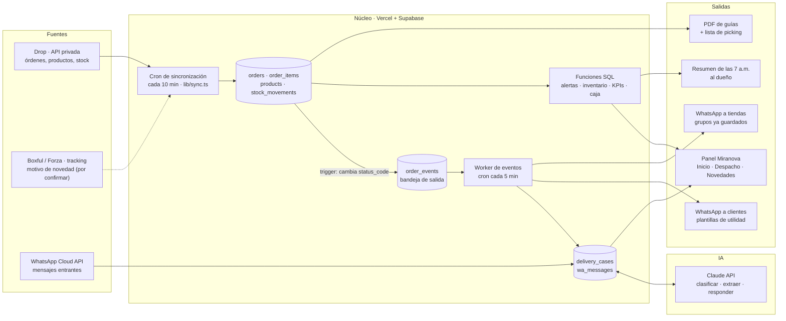
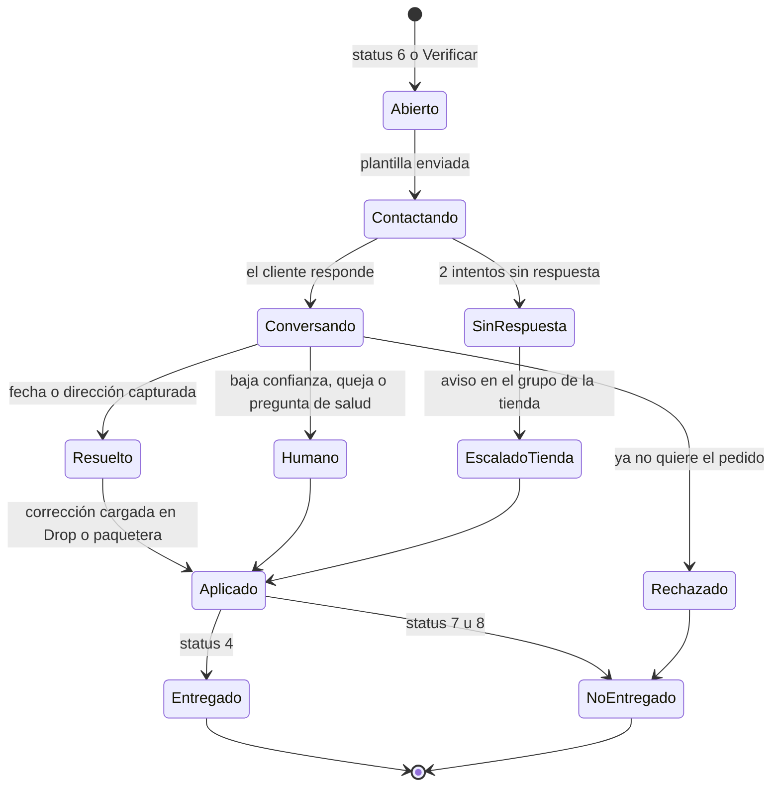
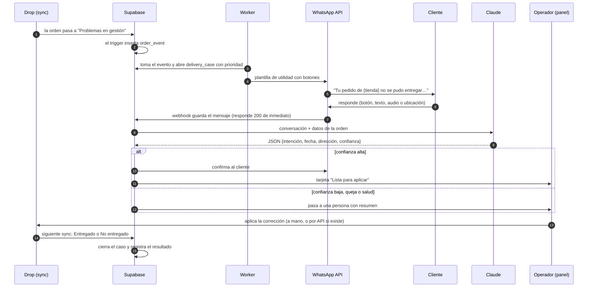

# Blueprint de automatización operativa · Miranova

Arquitectura para que el mismo equipo opere muchos más pedidos sin contratar. Parte del sistema
que ya existe en este repositorio y de los datos reales de la base `miranova-system-bd`
(corte: 28 sep 2026). Las cifras de "hoy" salen de consultas a esa base; las metas y
estimaciones están marcadas como tales.

---

## 0. Resumen ejecutivo

**Tres hallazgos cambian el enfoque:**

1. **La ingesta ya está automatizada.** El panel sincroniza Drop cada 10 minutos sin navegador
   (órdenes, productos y movimientos de stock), normaliza estados y calcula alertas, inventario y
   salud de tiendas. La Fase 1 no empieza de cero: se reduce a herramientas de despacho.
2. **El dinero se pierde en las novedades.** En Honduras (83 % del volumen), entre los pedidos
   creados hace 10 a 45 días:

   | | Pedidos | Entregados | No entregados | Aún atorados | Entrega |
   |---|---|---|---|---|---|
   | **Nunca** tuvieron novedad | 1,626 | 1,404 | 18 | — | **98.7 %** |
   | **Sí** pasaron por "Problemas en gestión" | 1,834 (53 %) | 484 | 498 | 363 | **49 %** |

   Casi todas las no entregas de Honduras (498 de 516, ~96 %) pasan antes por una novedad. Ese es
   el punto donde automatizar paga más. Hoy hay **719 pedidos en novedad en Honduras con
   L 252,672 (~US$9.8k) de ingreso de proveedor en juego**.
3. **Drop no tiene API pública ni webhooks, y no dice el motivo de la novedad.** Solo marca
   "Problemas en gestión" (código `6`). El diseño usa el sondeo periódico que ya existe, convierte
   los cambios de estado en eventos propios y obtiene el motivo del tracking de Boxful (por
   investigar) o preguntándole al cliente.

**Decisión de arquitectura:** el sistema actual (Next.js en Vercel + Supabase) sigue siendo el
núcleo y la única fuente de verdad. **No** se agrega Airtable ni Google Sheets como base de datos:
duplicarían datos que ya están modelados en Postgres. n8n o Make quedan como pegamento opcional
para flujos que alguien sin código quiera editar. La IA (Claude) entra donde multiplica: la
conversación con el cliente final para resolver novedades.

**Secuencia por retorno:**

| Fase | Qué | Duración estimada | Palanca |
|---|---|---|---|
| 0 · Hecho | Ingesta, estados, alertas, inventario, tiendas, usuarios y permisos | — | Base |
| 1 · Quick win | Eventos de cambio de estado, lote de despacho (picking + guías en un PDF), SLA de despacho, resumen diario | 1–2 semanas | Horas de bodega y de revisión |
| 2 · Margen | Cola de novedades → WhatsApp asistido → agente de WhatsApp con Claude, con grupo de control | 3–6 semanas | Recuperación de novedades |
| 3 · Escala | Portal y reportes para tiendas, Dropi, más países | 6–10 semanas | Menos soporte por tienda, más tiendas por persona |

**Escenario de valor (estimado, no promesa):** si la recuperación de novedades en Honduras sube de
49 % a 65 %, con ~1,500 novedades al mes, son ~240 pedidos más entregados al mes. A ~L 340 de
ingreso de proveedor por pedido son **~L 82,000 al mes (~US$3.2k)**. Para las tiendas es más:
~L 263,000 en ventas que no se pierden, lo que las retiene. El costo de IA estimado es de
US$45–90 al mes; ver 4.5.

---

## 1. Punto de partida: lo que ya existe

| Capacidad | Estado | Dónde |
|---|---|---|
| Login a Drop por cuenta (con 2FA), elección de cuenta, contraseñas cifradas | ✅ | `lib/sync.ts`, `lib/connectors/soydrop.ts`, `lib/crypto.ts`, `lib/totp.ts` |
| Sincronización cada 10 min: órdenes recientes (45 días), abiertas antiguas, historial por meses | ✅ | `vercel.json`, `app/api/cron/sync/route.ts` |
| Catálogo y movimientos de stock por producto | ✅ | `lib/products.ts`, `lib/stock-movements.ts`, migración 0017 |
| Estados agrupados: por despachar, tránsito, entregadas, problemas, no entregadas, canceladas | ✅ | `lib/status.ts` |
| Línea de tiempo de cada orden (registrada, despachada, recolectada, entregada…) | ✅ | `raw.orderInfo.statusTimeline`, vistas de la migración 0008 |
| Alertas del dueño: cuenta detenida, pedidos atorados, entrega baja por paquetera o producto, sin liquidar | ✅ | migración 0009, `lib/alerts.ts` |
| Tiempos por paquetera (horas a despacho, días a entrega, P90) | ✅ | migración 0011 |
| Inventario: días de cobertura, qué reponer, devoluciones | ✅ | migración 0018, `lib/inventory.ts` |
| Salud de tiendas, oportunidades, venta cruzada, contactos y grupos de WhatsApp de tiendas | ✅ | `lib/stores.ts`, `lib/opportunities.ts`, `lib/cross-sell.ts`, migración 0019 |
| Usuarios con permisos por sección | ✅ | `lib/permissions.ts`, migración 0021 |
| Conector Dropi | ✅ construido, ⏸ cuenta pausada | `lib/connectors/dropi.ts` |
| Lote de despacho: picking consolidado + guías en un solo PDF | ❌ | — |
| Eventos de cambio de estado (para disparar acciones) | ❌ | — |
| Cola de novedades, WhatsApp, agente de IA | ❌ | — |
| Proyección de caja | ❌ | — |
| Resumen diario push (WhatsApp o correo) | ❌ | — |
| Portal para tiendas | ❌ | — |

---

## 2. Restricciones reales que condicionan el diseño

| Supuesto del encargo | Lo que se verificó | Consecuencia |
|---|---|---|
| Drop por API o webhooks | La API de Drop es privada y no documentada. No hay webhooks. El conector usa las rutas internas de la web. | Se sondea cada 10 min (ya existe). Un trigger en la base convierte cada cambio de estado en un evento propio (sección 3.2). |
| Se conoce el motivo de la novedad | Drop solo da `shipmentStatus`, `shipmentStatusDescription` ("Problemas en gestión"), guía, tracking y etiqueta. No hay campo de motivo. | Se investiga el tracking de Boxful (1–2 días). Si no se puede leer, el agente le pregunta al cliente. |
| Integración con Forza para crear guías | Las guías las genera Drop por medio de Boxful (`labelUrl` en el almacenamiento de Boxful, tracking en `tracking.goboxful.com`). | No hace falta integrarse con Forza para crear guías: solo descargarlas, unirlas e imprimirlas. |
| El sistema puede corregir la orden | El conector es de **solo lectura**. No se sabe si la API privada permite escribir (reprogramar o corregir dirección). | Mientras no se confirme, la corrección la aplica una persona desde una cola "lista para aplicar" (un clic para copiar). Escribir en una API privada es riesgoso: puede romperse sin aviso. |
| Miranova puede escribirle al cliente final | El cliente le compró a la **tienda**, no a Miranova. WhatsApp exige plantillas aprobadas y consentimiento para mensajes iniciados por la empresa. | Es una decisión de negocio previa (sección 4.7): permiso de Drop y de cada tienda, y mensajes que nombran a la tienda. |
| Una tasa de entrega por país | El patrón cambia por país. En El Salvador casi ninguna falla pasa por "Problemas en gestión" (52 de 61 fallas llegan sin novedad previa). | La detección no puede depender solo del código `6`: se agrega "en tránsito más de lo normal" como disparador (4.1). |
| Sumar todo en una cifra | Cada cuenta tiene su moneda (HNL, GTQ, USD, CRC). | Todo KPI de dinero se muestra por moneda. En USD solo como referencia, con el tipo de cambio de `account_fx`. |

---

## 3. Arquitectura de datos e integraciones

### 3.1 Vista general



### 3.2 Patrón central: eventos de cambio de estado (el "webhook" que Drop no da)

Hoy la sincronización hace `upsert` de las órdenes por `(account_id, external_id)`
(`lib/store.ts`). Se agrega un **trigger en Postgres** que, cada vez que cambia `status_code`,
inserta una fila en `order_events`. Todo lo demás (novedades, SLA, avisos, métricas) se dispara
desde esa tabla. Ventajas:

- **No depende de cómo se sincroniza:** el cron, el backfill, la extensión o Dropi generan eventos igual.
- **Idempotente:** el worker marca `processed_at`, y si falla se reintenta sin duplicar acciones.
- **Auditable:** queda la hora exacta en que el sistema vio cada cambio. Sirve para medir tiempos
  aunque la línea de tiempo de Drop cambie de formato.

```sql
-- 0024_order_events.sql (borrador)
create table public.order_events (
  id           bigint generated always as identity primary key,
  order_id     uuid not null references public.orders(id) on delete cascade,
  account_id   uuid not null,
  from_code    text,
  to_code      text not null,
  seen_at      timestamptz not null default now(),
  processed_at timestamptz,        -- null = pendiente para el worker
  attempts     int not null default 0,
  last_error   text
);
create index order_events_pending_idx on public.order_events (seen_at) where processed_at is null;

create function public.log_status_change() returns trigger language plpgsql as $$
begin
  if tg_op = 'INSERT' or new.status_code is distinct from old.status_code then
    insert into public.order_events (order_id, account_id, from_code, to_code)
    values (new.id, new.account_id, case when tg_op = 'UPDATE' then old.status_code end, new.status_code);
  end if;
  return new;
end $$;

create trigger orders_status_change
  after insert or update of status_code on public.orders
  for each row execute function public.log_status_change();
```

**Reglas del worker** (nueva ruta, p. ej. `app/api/cron/events/route.ts`, con su propia entrada en
`vercel.json` cada 5 min):

- Toma un lote con `for update skip locked` (una función SQL `claim_events(limit)`), para que dos
  ejecuciones no procesen lo mismo.
- **Ignora eventos de pedidos con más de 20 días.** Al cargar historial o agregar una cuenta, el
  trigger genera miles de eventos viejos que no deben disparar mensajes.
- Cada tipo de evento es una función pura en `lib/` con pruebas en `lib/*.test.ts`, igual que
  `lib/stores.ts` o `lib/inventory.ts`.

### 3.3 Disparadores y acciones

| # | Disparador | Condición | Acción | Fase |
|---|---|---|---|---|
| T1 | Orden nueva (`→ registered`) | — | Entra a "Por despachar" y al próximo lote de picking | 1 |
| T2 | Sin despachar | `registered` hace más de 12 h, o registrada antes del corte y sin despachar al corte | Alerta en Inicio y en el resumen; si son 20 o más, aviso inmediato | 1 |
| T3 | Guía creada (`→ fulfilled` / `-1`) | Tiene `label_url` | Disponible para el PDF del lote; no se imprime dos veces | 1 |
| T4 | Novedad (`→ 6` o `→ pending_correction`) | Pedido de 20 días o menos, sin caso abierto | Abre `delivery_case` con prioridad y arranca la secuencia de contacto (4.4) | 2 |
| T5 | Tránsito lento | En `1/2/3/12` más del P75 de días de su paquetera y departamento | Caso preventivo ("¿vas a estar para recibir?"); es el disparador de El Salvador | 2 |
| T6 | Novedad sin cambio | Caso abierto, sin respuesta del cliente tras 2 intentos o 48 h | Aviso a la tienda en su grupo de WhatsApp con la lista de pedidos | 2 |
| T7 | Entregado (`→ 4`) | — | Cierra el caso como recuperado; queda esperando liquidación | 2 |
| T8 | No entregado (`→ 7/8`) | — | Cierra el caso como perdido, guarda el motivo y espera la devolución en inventario | 2 |
| T9 | Entregado sin liquidar | Más de 3 días sin `paid` | Ya existe (`unpaid_late`); pasa al resumen diario | 1 |
| T10 | Stock crítico | Cobertura menor a 3 días, o agotado con pedidos esperando | Ya existe; pasa al resumen diario con unidades sugeridas | 1 |
| T11 | Tienda en caída | Semáforo "Alerta" | Ya existe; crea un seguimiento sugerido para el responsable | 3 |

### 3.4 Tablas nuevas

```sql
-- Lotes de despacho (Fase 1)
create table public.dispatch_batches (
  id          uuid primary key default gen_random_uuid(),
  account_id  uuid not null,
  created_by  uuid,                       -- app_users.id
  created_at  timestamptz not null default now(),
  order_ids   uuid[] not null,
  pdf_path    text                        -- en Storage, como product_media
);

-- Casos de novedad (Fase 2)
create table public.delivery_cases (
  id              uuid primary key default gen_random_uuid(),
  order_id        uuid not null unique references public.orders(id) on delete cascade,
  account_id      uuid not null,
  trigger         text not null,          -- 'problem' | 'slow_transit'
  state           text not null default 'open',
  reason          text,                   -- no_contesta | direccion | ausente | rechaza | otro
  priority        numeric not null default 0,
  arm             text not null,          -- 'contact' | 'control' (medición, 4.8)
  resolution      jsonb,                  -- salida estructurada de Claude (4.5)
  next_action_at  timestamptz,
  opened_at       timestamptz not null default now(),
  closed_at       timestamptz,
  outcome         text                    -- delivered | failed
);

create table public.wa_messages (
  id          bigint generated always as identity primary key,
  case_id     uuid references public.delivery_cases(id) on delete cascade,
  wa_id       text unique,                -- id de WhatsApp: evita duplicados del webhook
  direction   text not null,              -- in | out
  kind        text not null,              -- template | text | button | audio | location
  body        jsonb not null,
  created_at  timestamptz not null default now()
);
```

Con el mismo esquema que el resto: RLS activado sin políticas y acceso solo con la
`service_role` desde el servidor.

---

## 4. Motor de novedades COD

### 4.1 Detección

- **Novedad declarada:** cambio a `6` (Problemas en gestión) o `pending_correction` (Verificar). En
  Honduras cubre casi todas las fallas.
- **Riesgo por tránsito lento:** para países donde la falla llega sin novedad previa (El
  Salvador), el disparador T5 usa los tiempos que ya calcula la migración 0011 (mediana y P90 por
  paquetera).
- **Motivo:** primero se intenta leer el tracking de Boxful (`tracking_url` ya se guarda). Si trae
  el motivo ("cliente no contesta", "dirección incompleta"…), se guarda en `reason` y cambia el
  primer mensaje. Si no, el primer mensaje es neutro y el motivo lo da el cliente.

> **Spike de 1–2 días (inicio de la Fase 2):** abrir algunas guías de `tracking.goboxful.com` y
> revisar si la página carga el historial desde un endpoint JSON con el motivo. Si existe, se
> agrega como paso opcional del sync solo para pedidos en novedad (pocos cientos, no miles).

### 4.2 Prioridad de la cola

```
prioridad = vendor_amount × tasa_recuperación(cuenta, paquetera, departamento) × factor_edad
```

- `tasa_recuperación` sale de los casos ya cerrados. Mientras no haya suficientes, se usa la
  entrega histórica por departamento, que ya calcula la vista Negocio.
- `factor_edad` sube durante las primeras 24 h (es cuando más se recupera) y baja después de 72 h.
- La cola se ordena por prioridad. El operador o el agente atiende primero lo que más dinero salva.

### 4.3 Ciclo de vida de un caso



Si Drop reporta "Entregado" o "No entregado" en cualquier momento, el caso se cierra solo, esté en
el estado que esté, y no se envían más mensajes.

### 4.4 Secuencia de contacto



**Cadencia:**

| Momento | Acción |
|---|---|
| T+0 (dentro del horario 8:00–19:00 de la cuenta) | Plantilla 1 con botones: *Reprogramar* · *Cambiar dirección* · *Ya no lo quiero* |
| T+3 h sin respuesta | Plantilla 2 (recordatorio corto) |
| Mañana siguiente, 9:00, sin respuesta | Estado "SinRespuesta" y aviso a la tienda (T6) |
| Cliente responde | Conversación libre dentro de la ventana de 24 h de WhatsApp, atendida por el agente |

### 4.5 Agente de WhatsApp con Claude

**Qué hace:** entiende la respuesta del cliente (texto, botón, nota de voz transcrita o ubicación),
extrae datos accionables y redacta una respuesta corta. **No** decide nada fuera de ese carril.

**Qué recibe:** nombre de pila del cliente, tienda, producto, ciudad y departamento, dirección y
referencia actuales, paquetera, motivo si se conoce y los mensajes del caso. No recibe correo ni
datos de otras órdenes.

**Salida estructurada** (con `output_config.format`, validada antes de usarla):

```ts
type Resolution = {
  intent: "reprogramar" | "cambiar_direccion" | "ya_no_lo_quiere" | "pregunta" | "queja" | "otro";
  delivery_date: string | null;          // YYYY-MM-DD, nunca antes de mañana
  time_window: "manana" | "tarde" | "todo_el_dia" | null;
  address: { street: string; reference: string | null; city: string | null; department: string | null } | null;
  location: { lat: number; lng: number } | null;   // si el cliente mandó su ubicación
  alt_phone: string | null;
  needs_human: boolean;
  human_reason: string | null;           // queja, pregunta de salud o de pago, idioma, enojo
  reply: string;                         // mensaje corto, español de Centroamérica
  confidence: number;                    // 0–1; menos de 0.7 va a una persona
};
```

**Límites del agente (van en el prompt de sistema y se validan en código):**

- Nunca promete reembolsos, descuentos, regalos ni cambios de precio.
- **Nunca hace afirmaciones de salud** sobre suplementos (drenaje linfático, cayena, hígado,
  creatina). Cualquier pregunta de ese tipo pasa a una persona o a la tienda.
- No envía mensajes fuera del horario local de la cuenta ni más de 2 plantillas por caso.
- Respeta "NO" / "BAJA" / "ya no me escriban" y marca el número como excluido.
- Si el cliente está enojado, amenaza o pide hablar con alguien, pasa a una persona.

**Modelo y costo (estimado):**

- Modelo `claude-opus-5` con `effort: "low"` (es clasificación y extracción), salida estructurada y
  caché del prompt de sistema. Tarifa de lista: US$5 por millón de tokens de entrada y US$25 por
  millón de salida.
- Una conversación típica (4 turnos, prompt de sistema en caché) cuesta del orden de US$0.03–0.06.
  Con ~1,500 casos al mes son **~US$45–90 al mes**.
- Antes de pensar en un modelo más barato (`claude-sonnet-5` a US$2/US$10 o `claude-haiku-4-5` a
  US$1/US$5), medirlo con 100 conversaciones reales etiquetadas: el costo actual ya es chico frente
  a lo que se recupera.
- **Notas de voz:** Claude no recibe audio. Se transcriben antes con un servicio de voz a texto
  (p. ej., ElevenLabs Speech-to-Text) y se pasa el texto.
- **Ubicación de WhatsApp:** llega como latitud y longitud. Se guarda tal cual y se agrega como
  enlace de mapa a la corrección, que suele valer más que una dirección escrita.

### 4.6 Aplicar la resolución

| Opción | Cuándo | Cómo |
|---|---|---|
| A. Cola "Lista para aplicar" (por defecto) | Mientras no haya escritura confiable en Drop | Tarjeta con la dirección y referencia nuevas, fecha y ventana, ubicación y teléfono alterno, con botón para copiar al formato que pide Drop o la paquetera. El operador marca "Aplicado". |
| B. Escritura por API | Solo si se confirma que la API privada de Drop o de Boxful acepta la corrección | Mismo flujo, sin el paso manual. Con reintentos, registro y un interruptor para apagarlo si la API cambia. |
| C. Tienda | Casos escalados | El mensaje al grupo de la tienda lleva el resumen y los datos capturados, listos para que la tienda gestione. |

La opción A ya es 5–10 veces más rápida que llamar: el operador recibe los datos listos en vez de
conseguirlos.

### 4.7 Cumplimiento (decisión previa del dueño)

- **¿Quién le escribe al cliente?** El cliente le compró a la tienda. Antes de enviar mensajes
  automáticos hay que confirmar que las reglas de Drop lo permiten y tener el visto bueno de cada
  tienda. Se guarda como una marca por tienda (`auto_contact` en `store_contacts`). Las tiendas que
  no participen reciben sus casos por su grupo (opción C).
- **Identidad:** el mensaje siempre nombra a la tienda ("tu pedido de {tienda}") para que el
  cliente lo reconozca. El número de WhatsApp puede ser uno neutro de entregas, verificado en Meta.
- **Plantillas:** categoría de utilidad (seguimiento de un pedido existente), aprobadas por Meta y
  sin contenido promocional.
- **Consentimiento:** conviene que el checkout de las tiendas diga que el cliente puede ser
  contactado por WhatsApp "por la tienda y sus aliados logísticos" para coordinar la entrega.
- **Datos personales:** mínimo necesario hacia la IA, mensajes guardados 90 días y el mismo
  esquema de acceso que hoy (RLS sin políticas y `service_role` solo en el servidor).

### 4.8 Cómo saber si funciona

Un 10–20 % de los casos, al azar, queda como **grupo de control** (`arm = 'control'`): no se
contactan desde Miranova y siguen el proceso actual. Se compara la recuperación de los dos grupos
durante 3–4 semanas. Sin esto no se puede separar el efecto del agente de un cambio de temporada o
de paquetera, y no se sabe si paga su costo. Cuando la diferencia sea clara, el control baja al 5 %
como vigilancia permanente.

---

## 5. Tablero diario (scorecard)

### 5.1 Indicadores

| Indicador | Definición exacta | Hoy | Meta (estimada) |
|---|---|---|---|
| **Entrega efectiva** | entregadas ÷ (entregadas + no entregadas), pedidos creados en los últimos 30 días | HN 82 % · SV 79 % · GT 92 % · CR 52 % | HN ≥ 86 % |
| **Entrega por paquetera** | Igual, pedidos creados hace 7–60 días (ya cerrados) | HN: Forza 79 %, Cargo Expreso 72 % · SV: Xpress 77 %, Forza 77 % · GT: Forza 89 % · CR: Wyn 52 %, Moovin 65 % | Decidir paqueteras con datos |
| **RTO %** | 1 − entrega efectiva, más las devoluciones que ya volvieron a bodega (movimientos de stock de devolución) | HN ~18 % | HN ≤ 14 % |
| **Tasa de novedad** | % de pedidos que tocaron "Problemas en gestión" | HN 53 % · GT 20 % · SV 5 % · CR 53 % | Bajarla con mensajes preventivos (Fase 2b) |
| **Recuperación de novedad** | entregadas ÷ cerradas, entre pedidos con novedad | HN 49 % · GT 55 % | HN ≥ 65 % |
| **Speed-to-fulfillment** | Mediana y P90 de horas entre "Orden registrada" y "Orden despachada" | HN 7.3 h / 28.2 h · GT 11.8 / 40.1 · SV 15.8 / 40.6 · CR 15.4 / 29.0 | P90 < 12 h |
| **Recolección** | Mediana de horas entre "Orden despachada" y "Recolectado" | HN 6.6 h · GT 8.5 · SV 15.3 · CR 5.4 | Depende del horario de la paquetera |
| **Despacho el mismo día** | % de las registradas antes del corte que se despachan ese día | Nuevo | ≥ 90 % |

Todos salen de la línea de tiempo que ya se guarda (`statusTimeline`) y de `order_events`. La
tasa de novedad y la recuperación son funciones SQL nuevas. Las demás extienden las de las
migraciones 0009 y 0011.

### 5.2 Proyección de caja (por moneda, nunca sumadas)

| Bloque | Cálculo | Honduras hoy |
|---|---|---|
| Liquidado | Σ `vendor_amount` con `paid = true` (por fecha de `payment.paidAt`) | — |
| Por liquidar | Entregado y sin `paid` | L 7,496 (Drop liquida rápido) |
| Esperado de tránsito | Σ `vendor_amount` en tránsito × entrega histórica (cuenta × paquetera) | L 424,228 × ~0.79 ≈ **L 335k** |
| Esperado de novedades | Σ `vendor_amount` en novedad × recuperación | L 252,672 × 0.49 ≈ **L 124k** (con 65 %: L 164k) |
| Esperado por despachar | Σ `vendor_amount` por despachar × entrega histórica | L 55,029 × ~0.8 ≈ L 44k |

**Cuándo llega:** fecha esperada = recolección + mediana de días a entrega (paquetera y
departamento) + mediana de días de entregado a liquidado (`payment.paidAt` ya viene en el JSON
original). Con eso se arma la curva a 7 y 14 días en una función `cash_forecast(account, days)`.
Todo marcado como estimado.

### 5.3 Stock crítico

Ya existe: cobertura = existencia ÷ salida neta diaria de 14 días, con niveles *Agotado*,
*Reponer ya* (menos de 3 días) y *Reponer pronto* (menos de 7). Se agregan:

- `lead_time_days` y `reorder_qty` por producto (lo que tarda el proveedor).
- **Punto de reorden** = salida diaria × (tiempo de reposición + días de seguridad). El aviso sale
  cuando la cobertura cruza ese punto, no cuando ya está en rojo.
- Pedidos por despachar que esperan un producto agotado, como alerta roja en el resumen.

### 5.4 Pantalla de Inicio y resumen de las 7 a.m.

Boceto. Las cuatro cifras de arriba son las de hoy; las líneas de "Hoy" son ilustrativas.

```
┌ Inicio · Todas las cuentas ────────────────────────────────────────────┐
│ Por despachar   161 · P90 28 h │ Novedades  719 · L 253k en juego      │
│ Entrega 30 d    82 %  (HN)     │ Caja 7 días  L ~xxx esperado          │
├────────────────────────────────────────────────────────────────────────┤
│ Hoy                                                                     │
│ • Honduras: 23 pedidos con más de 24 h sin despachar  → Generar lote   │
│ • 41 novedades listas para aplicar                    → Abrir cola     │
│ • Cayenne 60 cáps: 2.1 días de stock · reponer ~480 u → Inventario     │
│ • Costa Rica / Wyn: 52 % de entrega en 60 días        → Negocio        │
└────────────────────────────────────────────────────────────────────────┘
```

El mismo contenido sale todos los días a las 7:00 (hora de la cuenta principal) como plantilla de
WhatsApp al dueño o como correo: los 4 indicadores y las 3–5 alertas más importantes, con enlace
al panel. Reutiliza `owner_alerts`, así que no hay lógica duplicada.

---

## 6. Plan por fases

### Fase 1 · Quick win: despacho e ingesta (1–2 semanas, estimado)

La ingesta ya está. Esta fase ataca el trabajo manual de bodega y de revisión.

| Entregable | Detalle |
|---|---|
| `order_events` + trigger + worker | Sección 3.2. Es la base de las fases 2 y 3. |
| **Lote de despacho** | Página "Despacho": pedidos con guía lista, filtro por cuenta y paquetera, botón **Generar lote** que produce (1) un **PDF único** con todas las guías (unidas con `pdf-lib`) ordenadas por producto y (2) la **lista de picking** consolidada (SKU × unidades), con casillas para marcar. Guarda el lote en `dispatch_batches` para no imprimir dos veces. |
| SLA de despacho | T2: alerta de pedidos sin despachar a las 12 h o al corte, con contador en la navegación, como el de "Con problemas". |
| Resumen diario | 5.4, por correo (rápido de montar) o por plantilla de WhatsApp si ya está el número. |
| Indicadores base | Tasa de novedad, recuperación y despacho el mismo día (5.1), para tener la línea base **antes** de la Fase 2. |

**Criterio de salida:** P90 de horas a despacho por debajo de 12 h en Honduras. Imprimir guías es
un clic por lote en vez de abrir guía por guía.

**Pendiente de investigar (no bloquea):** si Drop permite "despachar" en lote desde su web,
usarlo. Automatizarlo por la API privada sería escritura: solo con pruebas y un interruptor.

### Fase 2 · Protección de margen: novedades COD (3–6 semanas, estimado)

Se construye en tres pasos para medir antes de invertir:

| Paso | Qué | Por qué primero |
|---|---|---|
| **2a · Cola asistida** (sin API de WhatsApp) | Página "Novedades" con la cola priorizada (4.2). Cada caso tiene un botón que abre WhatsApp con el mensaje ya escrito (`wa.me/<teléfono>?text=…`) y un formulario de resolución. Grupo de control desde el primer día. Spike de Boxful. | Sale en días, sin aprobación de Meta. Mide cuánto sube la recuperación con contacto rápido y junta las primeras conversaciones reales para probar el agente. |
| **2b · Agente de WhatsApp** | WhatsApp Cloud API (número verificado, plantillas de utilidad aprobadas), webhook en `app/api/whatsapp/route.ts`, agente con Claude (4.5), cola "Lista para aplicar" (4.6), escalamiento a tiendas (T6). | La persona pasa de conversar a aprobar: atiende cientos de casos al día en vez de decenas. |
| **2c · Prevención** | Experimento con grupo de control: al pasar a "En ruta", mensaje "tu pedido llega mañana, ¿confirmas dirección y que estarás?" (T5 para El Salvador). | Ataca el 53 % de novedades antes de que pasen. Cuesta más mensajes, por eso se prueba después y con control. |

**Criterio de salida:** diferencia medible de recuperación contra el grupo de control y menos de
10 % de casos que necesiten a una persona.

### Fase 3 · Escala: tiendas (6–10 semanas, estimado)

| Entregable | Detalle |
|---|---|
| **Portal de tiendas** | Usuario por tienda, limitado a su `store_id` (nuevo alcance sobre `app_users`). Ve sus pedidos, estados, novedades abiertas (y puede responderlas), entrega por producto y departamento, catálogo con fotos reales (`product_media`) y stock disponible. |
| Liquidaciones para tiendas | Drop es quien le paga a la tienda. El portal muestra una **estimación** por pedido (venta − precio proveedor − flete, con los datos del JSON) marcada como estimación, y el estado entregado/pagado que reporta Drop. No es un estado de cuenta oficial. |
| Reporte semanal automático por tienda | Por su grupo de WhatsApp: pedidos, entrega, novedades y una sugerencia (venta cruzada con `lib/cross-sell.ts`, ticket con ofertas 2x). |
| Seguimientos automáticos | Las alertas de tiendas (T11) crean seguimientos sugeridos. Hoy hay 0 registrados: la herramienta existe pero nadie la alimenta a mano. |
| Dropi y más países | Activar la cuenta Dropi Guatemala (conector ya hecho) y revisar las paqueteras de Costa Rica. |

**Criterio de salida:** menos mensajes de tiendas preguntando "¿qué pasó con mi pedido?" y más
tiendas activas por persona del equipo.

---

## 7. Stack recomendado

| Capa | Recomendado | Por qué | Alternativa |
|---|---|---|---|
| Base de datos y lógica | **Supabase Postgres** (ya existe) | Ya tiene 9.5k líneas de pedido, 23 migraciones de lógica, RLS y funciones SQL. Un solo lugar de verdad. | Airtable o Sheets solo como **exportación de lectura** si alguien los pide, nunca como base. |
| App, API y crons | **Next.js en Vercel** (ya existe) + tabla `order_events` como bandeja de salida | Código versionado y con pruebas (`npm test`). Cada cambio pasa por PR. | Supabase `pg_cron` + Edge Functions para el worker. |
| No-code opcional | **n8n** (self-hosted) o **Make** | Para flujos que el equipo quiera editar sin programar (textos de reportes a tiendas, avisos internos). Leen vistas de Supabase y no escriben en tablas del núcleo. | Zapier (más caro por volumen). |
| WhatsApp | **WhatsApp Cloud API** de Meta, directo o por un proveedor (BSP) como Kapso, 360dialog o Twilio | Plantillas de utilidad, webhooks, número verificado. El proveedor simplifica la aprobación y el panel de conversaciones. | — |
| IA | **Claude API**, `claude-opus-5` con `effort: "low"`, salida estructurada y caché de prompt | Español coloquial, extracción de direcciones y salida validada. Costo bajo frente a lo recuperado. | Medir `claude-sonnet-5` o `claude-haiku-4-5` con conversaciones reales antes de cambiar. |
| Voz a texto | ElevenLabs Speech-to-Text u otro servicio de voz a texto | Muchos clientes responden con nota de voz. | — |
| PDF | `pdf-lib` en Node | Unir guías y generar la lista de picking. | — |
| Avisos | Plantilla de WhatsApp al dueño + correo (p. ej., Resend) | Resumen de las 7 a.m. y alertas rojas. | Push del navegador. |
| Observabilidad | `order_events`, `ingest_log` (ya existe), tabla `automation_runs` y logs de Vercel | Saber qué se envió, qué falló y por qué. | — |

---

## 8. Riesgos y mitigación

| Riesgo | Impacto | Mitigación |
|---|---|---|
| Drop cambia su API privada | Se detiene la sincronización | Ya hay diagnóstico por ruta en Ajustes. Agregar alerta inmediata al dueño si una cuenta falla dos syncs seguidos. |
| El número de WhatsApp baja de calidad o lo bloquean | Se corta el canal | Solo plantillas de utilidad, a clientes con pedido activo, máximo 2 por caso, respetar la baja y subir el volumen poco a poco vigilando la calificación de calidad en Meta. |
| Conflicto con tiendas por contactar "sus" clientes | Pérdida de tiendas | Participación opcional por tienda, mensajes con el nombre de la tienda y reporte de cada caso a la tienda. |
| La IA promete algo o hace afirmaciones de salud | Reclamos o riesgo regulatorio | Salida estructurada, límites en código, paso a persona con baja confianza y un set de 100 conversaciones reales para probar antes de escalar. |
| Correcciones aplicadas tarde | El caso se pierde aunque el cliente respondió | Cola ordenada por prioridad, alerta si un caso "Resuelto" pasa 4 h sin "Aplicado", e investigar la escritura por API. |
| Eventos masivos al cargar historial | Mensajes a clientes de pedidos viejos | El worker ignora pedidos de más de 20 días, y el envío tiene un interruptor general por cuenta. |
| Concentración (en HN, 2 tiendas = 79 % de los pedidos) | Un solo cliente puede tumbar el mes | No es técnico, pero el tablero lo muestra y la alerta de tienda en caída ya existe. |

---

## 9. Qué significa 10x aquí (y qué no)

- **Sí es 10x o más:** el trabajo de información. Una persona que llama por teléfono gestiona
  unas decenas de novedades al día. Con el agente, esa persona aprueba cientos. Los reportes a
  tiendas y al dueño pasan de horas a cero minutos. Imprimir guías pasa de una por una a un clic
  por lote.
- **No es 100x:** el trabajo físico (picking, empaque, entrega a la paquetera) escala con la bodega.
  El lote de despacho y el picking consolidado lo mejoran quizá 1.5–2x, no 100x.
- **La métrica que manda:** pedidos entregados por persona del equipo por día, por cuenta. Se
  agrega al tablero para medir el avance real de cada fase.

---

## 10. Decisiones que necesita el dueño

1. **Contacto al cliente final:** confirmar con Drop que Miranova puede escribirle a los clientes y
   decidir cómo se pide el visto bueno a cada tienda (4.7).
2. **Número y nombre de WhatsApp:** un número nuevo verificado, y si se usa un proveedor (BSP) o la
   API de Meta directa.
3. **Grupo de control:** aceptar que un 10–20 % de los casos no se contacte durante 3–4 semanas para
   medir (4.8).
4. **Hora de corte de despacho** por cuenta (según la hora de recolección de cada paquetera), para
   el indicador de despacho el mismo día.
5. **Presupuesto mensual** de WhatsApp (tarifa de Meta por plantilla según país) e IA (~US$45–90 al
   mes estimado).

---

## Anexo: de dónde salen las cifras

Consultas de solo lectura a `miranova-system-bd` el 28 sep 2026:

- **Volumen y dinero de 30 días:** `orders` agrupado por cuenta y grupo de estado (`lib/status.ts`).
- **Novedades y recuperación:** pedidos creados hace 10–45 días. Se marca si algún evento de
  `raw.orderInfo.statusTimeline` tiene `status = '6'` y se cruza con el `status_code` actual.
- **Tiempos de despacho:** diferencia entre el primer evento `registered` y el primer `fulfilled` de
  la línea de tiempo (mediana y P90). Recolección: `fulfilled` → `2`.
- **Entrega por paquetera:** pedidos creados hace 7–60 días, `4` contra `7/8`, con 10 o más cerrados.
- **Dinero en juego:** Σ `vendor_amount` de los pedidos abiertos por grupo de estado, en la moneda de
  cada cuenta.
