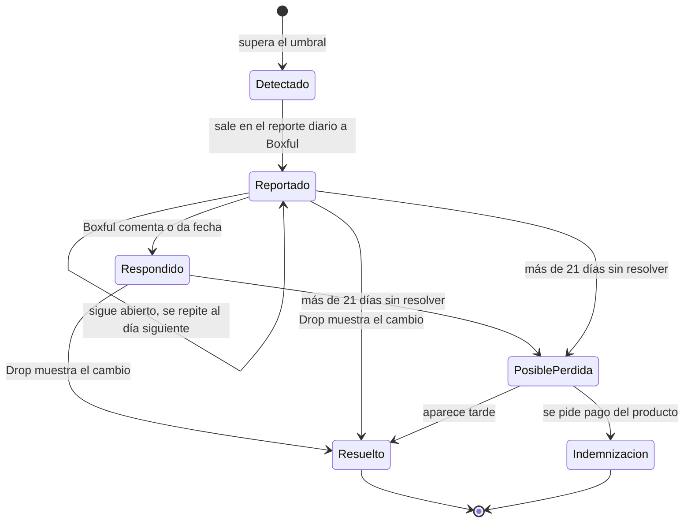
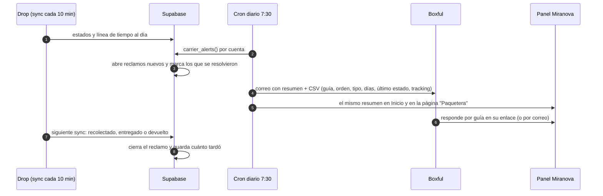
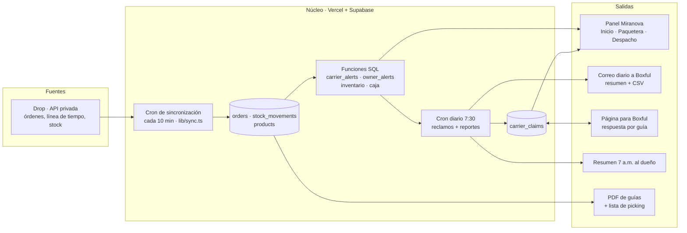

# Blueprint de automatización operativa · Miranova

Arquitectura para que el mismo equipo opere más pedidos sin contratar, dentro de lo que le toca a
Miranova como proveedor. Parte del sistema que ya existe en este repositorio y de los datos reales
de la base `miranova-system-bd` (corte: 28 sep 2026). Las cifras de "hoy" salen de consultas a esa
base; las metas y estimaciones están marcadas como tales.

---

## 0. Alcance: qué le toca a Miranova y qué no

| Le toca a Miranova | No le toca a Miranova |
|---|---|
| Preparar y despachar a tiempo (picking, empaque, guía) | Resolver novedades de entrega |
| Que la paquetera **recoja** lo despachado | Contactar a los clientes de las tiendas |
| Que la paquetera **mueva** lo que recogió (entregue o devuelva) | Confirmar pedidos ni reprogramar entregas |
| Que el producto no entregado **vuelva a bodega** | Vender ni hacer marketing por las tiendas |
| Cobrar lo entregado (liquidación de Drop) y tener stock | |

Las novedades se muestran en el panel solo como información. El sistema no actúa sobre ellas.

---

## 1. Resumen ejecutivo

**Dónde se pierde dinero de Miranova hoy (datos reales):**

| Problema con la paquetera | Honduras | El Salvador | Guatemala | Costa Rica |
|---|---|---|---|---|
| **Envíos sin movimiento más de 7 días** (recolectados o en ruta, sin cambio de estado) | **655 · L 213,483** (441 llevan más de 14 días) | 6 | 4 | 6 · ₡60,632 |
| **Devoluciones que no han vuelto** (no entregado hace más de 10 días, sin devolución en inventario) | **164 de 416** | 8 de 8 ⚠️ | 13 de 69 | 15 de 98 |
| **Recolección lenta** (de "Orden despachada" a "Recolectado", últimos 30 días) | 15 % pasa de 24 h · 4 % pasa de 48 h | 16 % pasa de 24 h · **11 % pasa de 48 h** | 0 % | 0 % |

- En Honduras hay **L 213,483 (~US$8.3k) de ingreso de proveedor detenido con la paquetera** por más
  de una semana. Unos 500 de esos 655 envíos tuvieron una novedad y luego volvieron a "En ruta a
  destino" sin cerrarse nunca: o van de regreso a bodega o quedaron olvidados. En cualquier caso,
  le toca a la paquetera entregarlos o devolverlos.
- 164 pedidos no entregados de Honduras no tienen devolución registrada en inventario después de
  10 días: es producto de Miranova que no ha vuelto.
- En El Salvador, Xpress tarda más en recoger: P90 de 87 h.
- ⚠️ En El Salvador no aparece **ninguna** devolución en los movimientos de inventario. Hay que
  confirmar con bodega si ahí se registran de otra forma.

**Propuesta:** un **control automático de la paquetera**. Todos los días el sistema detecta esos
tres casos, abre un reclamo por guía, le manda a Boxful la lista y cierra cada reclamo solo cuando
Drop muestra que se resolvió (recolectado, entregado o devuelto). Así se sabe cuánto tarda Boxful en
responder y cuánto se pierde.

**Arquitectura:** sin piezas nuevas grandes. Todo se calcula con la línea de tiempo que ya se
guarda por orden (`raw.orderInfo.statusTimeline`) y los movimientos de inventario que ya se
sincronizan. Se agrega una tabla de reclamos, una función SQL, un cron diario y un reporte. **No
hace falta IA** para esto.

**Secuencia por retorno:**

| Fase | Qué | Duración estimada | Palanca |
|---|---|---|---|
| 0 · Hecho | Ingesta de Drop cada 10 min, estados, alertas, inventario, tiendas, usuarios | — | Base |
| 1 · Control de Boxful | Recolección pendiente, envíos atorados, devoluciones pendientes, reporte diario a Boxful, reclamos con seguimiento | 1–2 semanas | Dinero y producto detenidos con la paquetera |
| 2 · Despacho | Lote de despacho (picking + guías en un PDF), SLA de despacho propio, resumen diario al dueño | 1–2 semanas | Horas de bodega |
| 3 · Escala | Proyección de caja, punto de reorden, vista informativa para tiendas, Dropi | 4–6 semanas | Caja y stock sin sorpresas |

---

## 2. Punto de partida: lo que ya existe

| Capacidad | Estado | Dónde |
|---|---|---|
| Login a Drop por cuenta (con 2FA), contraseñas cifradas | ✅ | `lib/sync.ts`, `lib/connectors/soydrop.ts` |
| Sincronización cada 10 min; las órdenes abiertas se revisan aunque sean viejas | ✅ | `vercel.json`, `lib/sync.ts` |
| Línea de tiempo por orden: registrada, despachada, registrado en courier, recolectado, en ruta, entregado, no entregado | ✅ | `raw.orderInfo.statusTimeline`, migración 0008 |
| Guía, tracking de Boxful (`tracking.goboxful.com`), etiqueta PDF y paquetera por orden | ✅ | `orders.tracking_number`, `tracking_url`, `label_url`, `carrier` |
| Movimientos de inventario con motivo (`ORDER_DISPATCH`, `ORDER_RETURN`…) y número de orden | ✅ | migración 0017, `lib/stock-movements.ts` |
| Alertas del dueño: pedidos atorados (más de 5 días), entrega baja por paquetera, sin liquidar | ✅ | migración 0009 |
| Tiempos por paquetera (horas a despacho, días a entrega, P90) | ✅ | migración 0011 |
| Inventario: días de cobertura y qué reponer | ✅ | migración 0018 |
| Reclamos a la paquetera con seguimiento | ❌ | — |
| Reporte automático a Boxful | ❌ | — |
| Lote de despacho (picking + guías en un PDF) | ❌ | — |
| Resumen diario push al dueño | ❌ | — |
| Proyección de caja | ❌ | — |

---

## 3. Control de la paquetera (Fase 1)

### 3.1 Qué se detecta

| Tipo | Condición | Umbral inicial (se ajusta por paquetera y país) | Se cierra solo cuando |
|---|---|---|---|
| **Recolección pendiente** | Tiene "Orden despachada" y no tiene "Recolectado" | Pasó el siguiente corte de recolección; por defecto, 24 h | Aparece "Recolectado" |
| **Envío sin movimiento** | Estado en tránsito (registrado en courier, recolectado, en ruta) sin ningún cambio | Más de 7 días (el P90 de días a entrega de Forza en Honduras es 7.0) | Cambia de estado: entregado, no entregado u otro movimiento |
| **Devolución pendiente** | "No entregado" y sin movimiento `ORDER_RETURN` de esa orden en inventario | Más de 10 días desde que se marcó no entregado | Aparece el `ORDER_RETURN` en inventario |

Todo sale de datos que ya están en la base. La consulta base es una función SQL
`carrier_alerts(account)`, con el mismo estilo que `owner_alerts` (migración 0009). La lógica de
presentación va en un módulo puro con pruebas (`lib/carrier-claims.ts` + `.test.ts`), como
`lib/inventory.ts`.

### 3.2 Ciclo de vida de un reclamo



"Resuelto" siempre lo decide la sincronización con Drop (o el inventario, para devoluciones), no
la respuesta de Boxful. Así la palabra de la paquetera no cierra un reclamo si el paquete sigue
sin moverse.

### 3.3 Flujo diario



### 3.4 Cómo le llega a Boxful

| Canal | Qué lleva | Esfuerzo | Recomendación |
|---|---|---|---|
| **Correo automático diario** | Resumen por país y tipo + CSV con una fila por guía | Bajo (Resend u otro servicio de correo desde el cron) | ✅ Empezar aquí |
| **Página para Boxful** (enlace con token, sin login, solo lectura de sus reclamos) | Lista viva de reclamos abiertos. Boxful escribe una respuesta por guía ("se entrega el jueves", "va de regreso") | Medio | ✅ En cuanto Boxful acepte usarla: se acaba el ida y vuelta de correos |
| **Grupo de WhatsApp con Boxful** | El panel arma el texto del resumen con un botón "Copiar para WhatsApp" | Muy bajo | ✅ Como complemento. Enviar a grupos por API no es confiable; copiar y pegar sí. |
| API de Boxful | Consultar o reportar por guía | Por investigar | Preguntar a Boxful si tiene API para clientes. Si la tiene, reemplaza la lectura por Drop para estos casos. |

**Contenido del CSV:** país, paquetera, guía (`FD…`), orden de Drop, tipo, fecha de despacho o de
último movimiento, días en esa situación, último estado, enlace de tracking y veces reportado.
**No** lleva datos del cliente (nombre, teléfono, dirección): Boxful ya los tiene por la guía, y
así el reporte no expone datos personales.

**Si el canal formal es Drop y no Boxful:** es el mismo reporte con otro destinatario (sección 9).

### 3.5 Tabla nueva

```sql
-- 0024_carrier_claims.sql (borrador)
create table public.carrier_claims (
  id               uuid primary key default gen_random_uuid(),
  order_id         uuid not null references public.orders(id) on delete cascade,
  account_id       uuid not null,
  carrier          text,
  tracking_number  text,
  kind             text not null,            -- 'pickup' | 'stalled' | 'return'
  state            text not null default 'open',  -- open | reported | answered | resolved | possible_loss | compensation
  amount           numeric,                  -- vendor_amount de la orden (moneda de la cuenta)
  units            int,                      -- unidades de producto en juego
  opened_at        timestamptz not null default now(),
  first_reported_at timestamptz,
  last_reported_at timestamptz,
  times_reported   int not null default 0,
  carrier_reply    text,                     -- lo que respondió Boxful
  carrier_reply_at timestamptz,
  resolved_at      timestamptz,
  resolution       text,                     -- picked_up | moved | delivered | failed | returned | lost
  unique (order_id, kind)
);
```

Con el mismo esquema que el resto: RLS activado sin políticas y acceso solo con la `service_role`
desde el servidor. La página para Boxful usa un token firmado por paquetera y solo puede escribir
`carrier_reply`.

### 3.6 Página "Paquetera" en el panel

- Tres pestañas: **Por recoger**, **Sin movimiento** y **Devoluciones**. Cada una con cuenta, monto
  por moneda, días y veces reportado.
- Filtro por cuenta y paquetera (Forza, Cargo Expreso, Xpress, Moovin, Wyn…).
- Indicadores de Boxful (sección 5): tiempo hasta resolver, % resuelto en 72 h y pérdidas del mes.
- Permiso nuevo en `lib/permissions.ts`: "Paquetera" (ver y exportar).

---

## 4. Despacho (Fase 2)

Lo que depende de Miranova antes de entregar a la paquetera.

| Entregable | Detalle |
|---|---|
| **Lote de despacho** | Página "Despacho": pedidos con guía lista, filtro por cuenta y paquetera, botón **Generar lote** que produce (1) un **PDF único** con todas las guías (unidas con `pdf-lib`) ordenadas por producto y (2) la **lista de picking** consolidada (SKU × unidades), con casillas. Se guarda el lote para no imprimir dos veces. |
| **SLA de despacho propio** | Alerta de pedidos "registrados" sin "despachar" pasado el corte o a las 12 h, con contador en la navegación. Hoy: mediana de 7.3 h y P90 de 28.2 h en Honduras; P90 de unos 40 h en Guatemala y El Salvador. |
| **Resumen de las 7 a.m. al dueño** | Por correo (o plantilla de WhatsApp): pendientes de despachar, reclamos abiertos con Boxful, stock crítico y liquidación pendiente. Reutiliza `owner_alerts` y `carrier_alerts`. |

```sql
create table public.dispatch_batches (
  id          uuid primary key default gen_random_uuid(),
  account_id  uuid not null,
  created_by  uuid,                 -- app_users.id
  created_at  timestamptz not null default now(),
  order_ids   uuid[] not null,
  pdf_path    text                  -- en Storage, como product_media
);
```

**Por investigar (no bloquea):** si Drop permite marcar "despachado" en lote desde su web, usarlo.
Hacerlo por la API privada sería escritura: solo con pruebas y un interruptor para apagarlo.

---

## 5. Tablero diario (scorecard)

### 5.1 Indicadores

| Indicador | Definición exacta | Hoy | Meta (estimada) |
|---|---|---|---|
| **Despacho propio** | Mediana y P90 de horas de "Orden registrada" a "Orden despachada" | HN 7.3 / 28.2 h · GT 11.8 / 40.1 · SV 15.8 / 40.6 · CR 15.4 / 29.0 | P90 < 12 h |
| **Recolección de la paquetera** | % de guías recolectadas en ≤ 24 h desde "Orden despachada" (30 días) | HN 85 % · SV 84 % · GT 100 % | ≥ 95 % |
| **Envíos sin movimiento** | Guías en tránsito sin cambio por más de 7 días, cantidad y monto | HN 655 · L 213,483 | < 50 |
| **Devoluciones pendientes** | No entregados hace más de 10 días sin devolución en inventario | HN 164 · CR 15 · GT 13 · SV 8 | 0 de más de 21 días |
| **Respuesta de Boxful** | Mediana de horas entre el primer reporte y la resolución; % resuelto en 72 h | Nuevo (arranca con la Fase 1) | Mediana < 72 h |
| **Pérdidas** | Reclamos con más de 21 días sin resolver, cantidad y monto | Nuevo | Acordar indemnización |
| Entrega por paquetera (informativo) | Entregadas ÷ (entregadas + no entregadas), pedidos de hace 7–60 días | HN: Forza 79 %, Cargo Expreso 72 % · SV: Xpress 77 %, Forza 77 % · GT: Forza 89 % · CR: Wyn 52 %, Moovin 65 % | — |

Los montos van siempre por moneda (L, Q, US$, ₡), nunca sumados.

### 5.2 Proyección de caja (Fase 3; por moneda)

| Bloque | Cálculo | Honduras hoy |
|---|---|---|
| Por liquidar | Entregado y sin `paid` | L 7,496 (Drop liquida rápido) |
| Esperado de tránsito normal | Σ `vendor_amount` en tránsito de 7 días o menos × entrega histórica de la paquetera | L ~210k × ~0.79 |
| **Detenido con la paquetera** | Σ `vendor_amount` de envíos sin movimiento de más de 7 días | **L 213,483** |
| Por despachar | Σ `vendor_amount` por despachar × entrega histórica | L 55,029 × ~0.8 |

Fecha esperada = recolección + mediana de días a entrega de la paquetera + mediana de días de
entregado a liquidado (`payment.paidAt` ya viene en el JSON). Se arma como una función
`cash_forecast(account, days)` a 7 y 14 días, marcada como estimación.

### 5.3 Stock

Ya existe la cobertura (existencia ÷ salida neta diaria) con niveles *Agotado*, *Reponer ya* y
*Reponer pronto*. Se agregan:

- `lead_time_days` por producto y **punto de reorden** = salida diaria × (tiempo de reposición +
  días de seguridad).
- **Devoluciones en camino** como stock que debería volver. Si no vuelve, es un reclamo de devolución.

### 5.4 Pantalla de Inicio

Boceto. Las cifras de arriba son las de hoy; las líneas de "Hoy" son ilustrativas.

```
┌ Inicio · Todas las cuentas ─────────────────────────────────────────────┐
│ Por despachar  161 · P90 28 h  │ Con Boxful sin movimiento  655 · L 213k │
│ Devoluciones pendientes  164   │ Recolección ≤ 24 h  85 % (HN)           │
├─────────────────────────────────────────────────────────────────────────┤
│ Hoy                                                                      │
│ • Honduras: 23 pedidos con más de 24 h sin despachar  → Generar lote    │
│ • Boxful: 38 reclamos nuevos · reporte enviado 7:30   → Paquetera       │
│ • 12 devoluciones con más de 21 días                  → Posible pérdida │
│ • Stock: 2 productos con menos de 3 días              → Inventario      │
└─────────────────────────────────────────────────────────────────────────┘
```

---

## 6. Arquitectura



**Por qué así:**

- **Una sola fuente de verdad (Supabase).** Airtable o Google Sheets duplicarían datos que ya están
  en Postgres. Si alguien los pide, se exporta el CSV.
- **Sin webhooks de Drop.** No existen. La sincronización de cada 10 minutos ya mantiene la línea
  de tiempo al día, y un control diario de la paquetera no necesita más frecuencia.
- **Sin IA en el camino crítico.** Las reglas son claras (días sin movimiento, devoluciones sin
  registrar) y deben ser auditables. Uso opcional: si Boxful responde por correo en texto libre,
  Claude puede leer la respuesta y anotar `carrier_reply` en cada guía. No es necesario para empezar.
- **n8n o Make, opcionales:** solo si alguien sin código quiere cambiar el formato o los
  destinatarios del correo. Leen una vista de Supabase y no escriben en las tablas del núcleo.

---

## 7. Stack

| Capa | Recomendado | Por qué |
|---|---|---|
| Datos y reglas | **Supabase Postgres** (ya existe) + funciones SQL | La línea de tiempo y el inventario ya están ahí. Las reglas en SQL son rápidas y auditables. |
| App, API y crons | **Next.js en Vercel** (ya existe) | Un cron más en `vercel.json`. Código con pruebas (`npm test`). |
| Correo | Resend (o Gmail/SMTP) | Reporte diario a Boxful y al dueño, con CSV adjunto. |
| PDF | `pdf-lib` en Node | Unir guías y generar la lista de picking. |
| Opcional | n8n o Make | Formatos y destinatarios editables sin código. |
| Opcional | Claude API | Leer respuestas en texto libre de Boxful. |

---

## 8. Riesgos

| Riesgo | Mitigación |
|---|---|
| La línea de tiempo de Drop no refleja un movimiento real de Boxful (el paquete se movió pero Drop no lo muestra) | Igual es un reclamo válido: sin ese estado Drop no liquida. La respuesta de Boxful queda anotada y el reclamo se cierra cuando Drop se actualiza. |
| Las devoluciones se registran distinto en algún país (El Salvador no tiene ninguna `ORDER_RETURN`) | Validar con bodega antes de reportar devoluciones de ese país. Mientras tanto, apagar ese tipo por cuenta. |
| Umbrales que generan demasiados reclamos | Arrancar con umbrales altos (7 días sin movimiento, 10 días para devolución), mostrar primero solo en el panel una semana y después enviar a Boxful. |
| Boxful no responde | Lo muestra el propio indicador (respuesta de Boxful). Es el argumento para negociar tarifas, indemnizaciones o cambiar de paquetera por país. |
| Drop cambia su API privada | Ya hay diagnóstico por ruta. Agregar aviso al dueño si una cuenta falla dos syncs seguidos. |

---

## 9. Decisiones que necesita el dueño

1. **A quién se le reporta:** ¿el contacto de Boxful (operaciones o ejecutivo de cuenta), Drop, o
   los dos? ¿Por correo, WhatsApp o ambos?
2. **Horarios de recolección** por cuenta y paquetera, para el umbral de "recolección pendiente" y
   el SLA de despacho propio.
3. **Umbrales iniciales:** 24 h para recolección, 7 días sin movimiento y 10 días para devolución.
   ¿Te sirven?
4. **Indemnización:** ¿existe un acuerdo con Boxful o Drop para paquetes perdidos? Define qué pasa
   con los reclamos de más de 21 días.
5. **Devoluciones en El Salvador:** ¿cómo se registran en bodega?

---

## Anexo: de dónde salen las cifras

Consultas de solo lectura a `miranova-system-bd` el 28 sep 2026:

- **Envíos sin movimiento:** órdenes con `status_code` en `1/2/3/12` cuyo último evento de
  `raw.orderInfo.statusTimeline` tiene más de 7 (o 14) días; monto = Σ `vendor_amount`.
- **Devoluciones pendientes:** órdenes en `7/8` cuyo primer evento de no entrega tiene más de 10 días
  y sin fila en `stock_movements` con `reason = 'ORDER_RETURN'` y el mismo número de orden.
- **Recolección:** primer evento `fulfilled` ("Orden despachada") contra primer evento `2`
  ("Recolectado"), guías despachadas en los últimos 30 días.
- **Despacho propio:** primer `registered` contra primer `fulfilled` (mediana y P90), pedidos de
  hace 10–45 días.
- **Entrega por paquetera:** pedidos creados hace 7–60 días, `4` contra `7/8`, con 10 o más cerrados.
